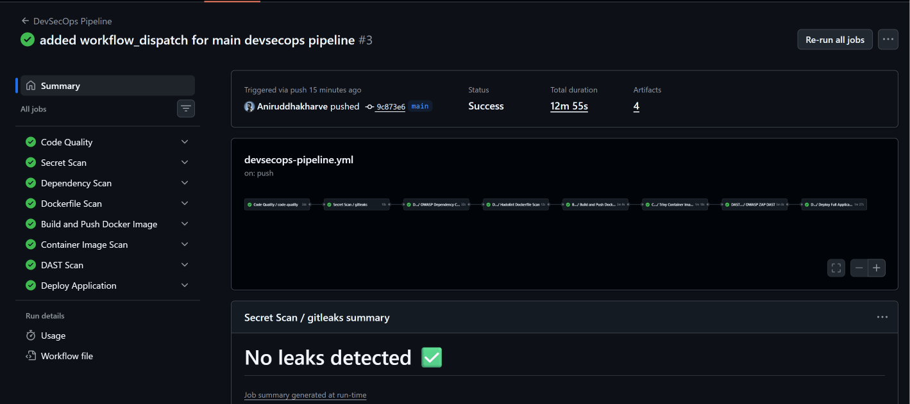
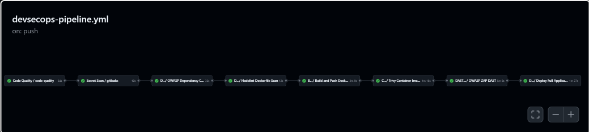
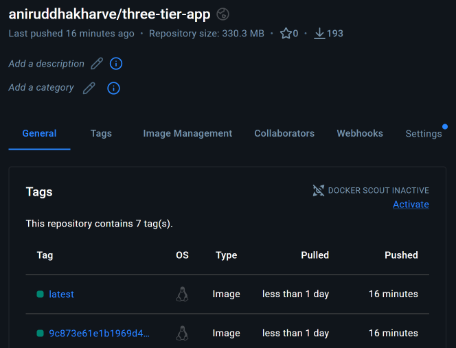
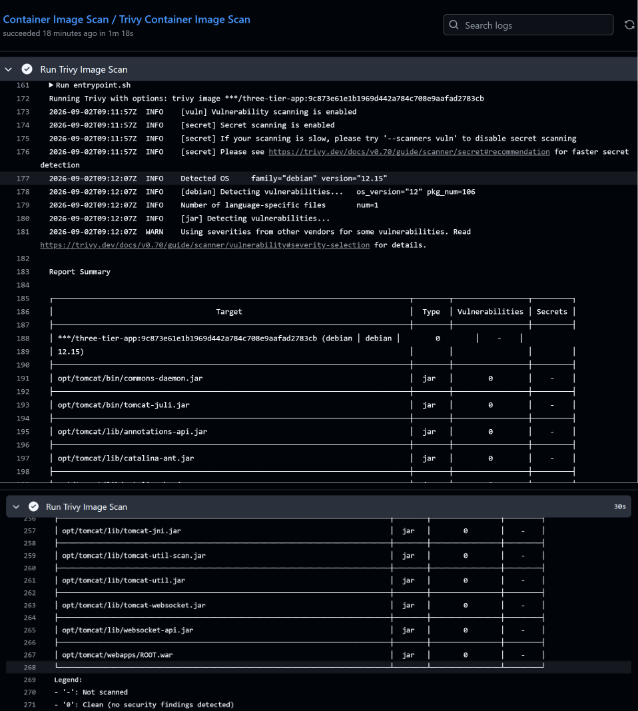
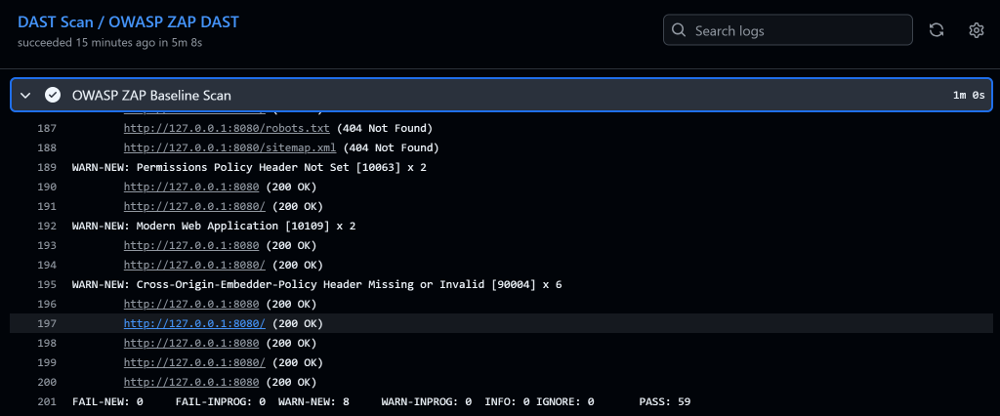
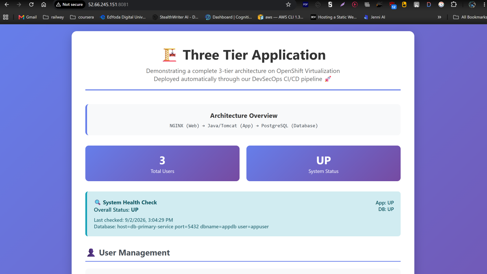
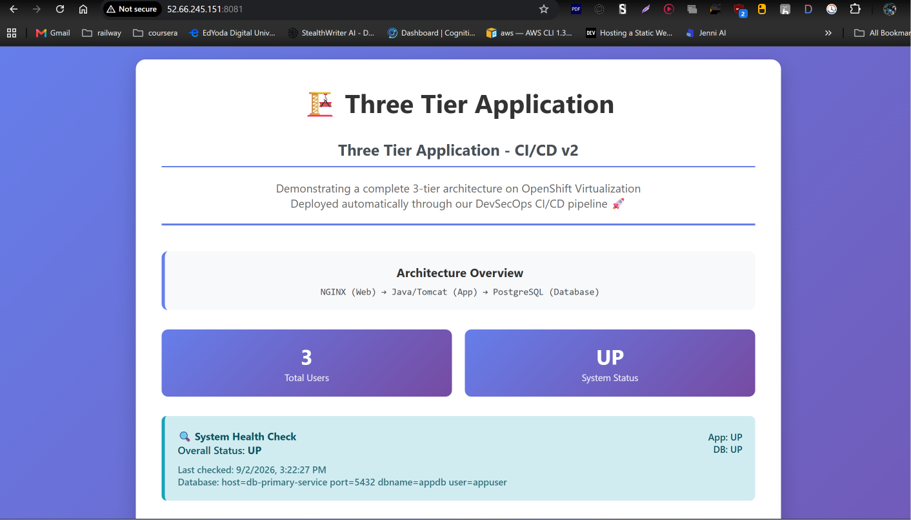
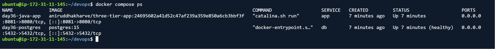

# 🚀 Three-Tier Java Application — Dockerized, Optimized & DevSecOps CI/CD

> A hands-on DevOps project that evolves a Java/Tomcat/PostgreSQL three-tier application from **local containerization** to a **security-gated CI/CD pipeline** and automated **AWS EC2 deployment**.

[](https://www.docker.com/)
[](https://github.com/features/actions)
[](https://aws.amazon.com/ec2/)
[](#-phase-2--devsecops-cicd-pipeline)
[](https://www.java.com/)
[](https://www.postgresql.org/)

---

## 📌 Project at a Glance

| Area | Implementation |
|---|---|
| Application | Java Servlet / Apache Tomcat 9 |
| Database | PostgreSQL 15 |
| Containerization | Docker + Docker Compose |
| Image Optimization | Multi-stage build + `jdeps` + `jlink` |
| Runtime Security | Non-root `tomcat` user |
| Image Registry | Docker Hub |
| CI/CD | GitHub Actions |
| Reusable Workflows | `workflow_call` + `needs:` + `secrets: inherit` |
| Code Quality | Maven, Checkstyle, SpotBugs, FindSecBugs |
| Secret Detection | Gitleaks |
| Dependency Security | OWASP Dependency-Check |
| Dockerfile Security | Hadolint |
| Container Security | Trivy |
| Dynamic Security Testing | OWASP ZAP |
| Deployment | AWS EC2 + SSH/SCP |
| Image Versioning | GitHub commit SHA |

### 🎯 What makes this project portfolio-ready?

This project demonstrates the complete journey rather than a single isolated DevOps task:

```text
Java Three-Tier Application
          │
          ▼
Docker Containerization
          │
          ▼
Image Optimization with jdeps + jlink
          │
          ▼
Docker Compose
          │
          ▼
Docker Hub
          │
          ▼
DevSecOps CI/CD
          │
          ├── Code Quality
          ├── Secret Scan
          ├── Dependency Scan
          ├── Dockerfile Scan
          ├── Container Scan
          └── DAST
          │
          ▼
Automated AWS EC2 Deployment
          │
          ▼
Running Application
          │
          ▼
End-to-End CI/CD Change Validation
```

---

## 🧭 Documentation Roadmap

- [🐳 Phase 1 — Dockerization & DevOps Implementation](#-phase-1--dockerization--devops-implementation)
  - [My Contribution](#-my-contribution)
  - [Containerized Architecture](#-containerized-architecture)
  - [Docker Build Architecture](#-docker-build-architecture)
  - [Docker Image Optimization](#-jlink-optimization--v3-jlink)
  - [Non-Root Container](#-non-root-container)
  - [PostgreSQL Container](#-postgresql-container)
  - [Docker Networking](#-custom-docker-network)
  - [Database Persistence](#-database-persistence)
  - [Docker Compose](#-docker-compose)
  - [Troubleshooting](#-problems-encountered--solutions)
- [🔐 DevSecOps CI/CD Pipeline](#-phase-2--devsecops-cicd-pipeline)
  - [Why DevSecOps?](#-why-devsecops)
  - [Reusable Workflows](#-reusable-github-actions-workflows)
  - [Main Pipeline](#-main-devsecops-pipeline)
  - [Pipeline Stages](#1--code-quality)
  - [AWS Deployment](#8--deploy-application)
  - [CI/CD Verification](#-cicd-verification)
  - [Pipeline Problems & Solutions](#-devsecops-problems-encountered--solutions)
- [🛠️ Final Technology Stack](#️-final-devsecops-technology-stack)
- [💼 Portfolio / Resume Description](#-updated-portfolio--resume-description)
- [🎯 Final Learning Outcomes](#-final-learning-outcomes)

---

## 🏆 Final Outcome

The application was successfully transformed from a traditional Java three-tier application into a **containerized, optimized, security-validated and automatically deployed application**. The completed GitHub Actions pipeline passed end-to-end, and a later change to `index.html` successfully travelled through the pipeline and appeared on the AWS-hosted application.

The deployed application uses:

```text
AWS EC2 :8081
      │
      ▼
Docker Container :8080
      │
      ▼
Tomcat / Java Application
      │
      ▼
PostgreSQL 15
```

**The detailed implementation below documents how that result was achieved.**

---


## 🐳 Phase 1 — Dockerization & DevOps Implementation

> **Phase 1:** Build, optimize, containerize, network and validate the application before introducing CI/CD security automation.

This repository contains my Docker and DevOps implementation built around the original three-tier Java web application.

I took the existing Java/Tomcat/PostgreSQL application and extended it with a complete containerized deployment workflow, including:

- 🐳 Docker containerization
- 🏗️ Multi-stage Docker builds
- ☕ Custom Java runtime using `jlink`
- 🔐 Non-root container execution
- 🐘 PostgreSQL containerization
- 🔗 Custom Docker bridge networking
- 💾 Persistent database storage using Docker volumes
- 🧩 Docker Compose orchestration
- ❤️ Database healthchecks
- 🌱 Environment-based configuration
- 📦 Docker image optimization
- 🚀 Docker Hub publishing
- 🔄 Fresh deployment from Docker Hub
- 🧪 Application and database health verification

### 📊 Docker Image Optimization

One of the main goals was to reduce the size of the Java application image.

| Version | Approach | Image Content Size |
|---|---|---:|
| `v1` | Tomcat + JDK 11 | ~209 MB |
| `v2-multistage` | Multi-stage Maven build + Tomcat/JDK 11 | ~209 MB |
| `v3-jlink` | Multi-stage build + custom `jlink` Java runtime | ~81 MB |

**Result: approximately 61% reduction in final image content size.**

The `v3-jlink` image is published on Docker Hub:

**Docker Hub:** https://hub.docker.com/r/aniruddhakharve/three-tier-java-app

### 🔗 My Project Repository

https://github.com/Aniruddhakharve/three-tier-java-app-dockerize

### 🔗 90 Days of DevOps – Day 36

https://github.com/Aniruddhakharve/90DaysOfDevOps-shubham-londe/tree/master/2026/day-36

---

## 🧑‍💻 My Contribution

The original application provides the Java three-tier application foundation. My work in this repository focuses on containerization, image optimization, Docker networking, persistent storage, Compose orchestration, troubleshooting, and Docker Hub distribution.

### Docker/DevOps work completed

1. Created a Docker image for the Java/Tomcat application.
2. Built and tested a PostgreSQL container.
3. Created a dedicated Docker bridge network named `three-tier-network`.
4. Connected the Java application and PostgreSQL containers through the Docker network.
5. Configured database connectivity using environment variables.
6. Created a multi-stage Dockerfile using Maven as the builder stage.
7. Investigated why the first multi-stage image did not reduce the final image size.
8. Created a `jlink`-based custom Java runtime.
9. Reduced the application image from approximately 209 MB to approximately 81 MB.
10. Configured the final container to run as the `tomcat` user instead of root.
11. Created Docker Compose configuration for the application and database.
12. Added build context support so Compose can build the application image locally.
13. Verified the application through the browser and `/health` endpoint.
14. Verified PostgreSQL connectivity from the application.
15. Published `latest` and `v3-jlink` images to Docker Hub.
16. Documented the implementation and troubleshooting process as part of the 90 Days of DevOps challenge.

---

## 🏗️ Containerized Architecture

```text
                        Client Browser
                             │
                             │ HTTP
                             ▼
                 ┌─────────────────────────┐
                 │      Java Web App       │
                 │                         │
                 │      Tomcat 9           │
                 │      Java 11             │
                 │      app.war             │
                 │                         │
                 │      USER tomcat         │
                 └────────────┬────────────┘
                              │
                              │ JDBC
                              ▼
                 ┌─────────────────────────┐
                 │      PostgreSQL 15      │
                 │                         │
                 │      Database: appdb    │
                 │      User: appuser       │
                 └────────────┬────────────┘
                              │
                              ▼
                    Docker Named Volume

                Both containers communicate
                through:

                   three-tier-network
```

**Current CI/CD deployment note:** The application service is now deployed from the immutable Git commit SHA image produced by the CI/CD pipeline. Docker Compose uses `${DOCKERHUB_USER}/three-tier-app:${DOCKER_TAG}` with `DOCKER_TAG=${GITHUB_SHA}`. The application remains exposed on host port `8081` and maps to Tomcat port `8080` inside the container (`8081:8080`).

---

## 🐳 Docker Build Architecture

```text
                      Source Code
                          │
                          ▼
                ┌─────────────────────┐
                │    Builder Stage    │
                │                     │
                │ Maven 3.9           │
                │ JDK 11              │
                │                     │
                │ mvn clean package   │
                └──────────┬──────────┘
                           │
                           │ app.war
                           ▼
                ┌─────────────────────┐
                │     jlink Stage     │
                │                     │
                │ Java 11 modules     │
                │ selected with       │
                │ jdeps + jlink       │
                └──────────┬──────────┘
                           │
                           │ Minimal JVM
                           ▼
                ┌─────────────────────┐
                │   Runtime Stage     │
                │                     │
                │ Tomcat 9            │
                │ Custom Java Runtime │
                │ app.war             │
                │ USER tomcat         │
                └──────────┬──────────┘
                           │
                           ▼
                     Docker Image
                           │
                           ▼
                      Docker Hub
```

---

## 📦 Docker Images

### Original Application Image – `v1`

The first Docker image used the Tomcat image containing the complete JDK.

```text
three-tier-java-app:v1
```

Observed size:

```text
~209 MB content size
```

Docker history showed that the majority of the image size came from the Java runtime and underlying Debian/Tomcat layers rather than the application itself.

---

### Multi-Stage Image – `v2-multistage`

I then introduced a multi-stage Docker build.

```text
Builder:
Maven + JDK 11
       │
       ▼
    app.war
       │
       ▼
Runtime:
Tomcat + JDK 11
```

Image:

```text
three-tier-java-app:v2-multistage
```

The final image was still approximately:

```text
~209 MB
```

### Why didn't multi-stage reduce the image size?

Multi-stage builds remove the builder environment from the final image, but the runtime stage was still based on a full Tomcat/JDK image.

Therefore:

```text
Builder dependencies removed
             ↓
Full JDK still present
             ↓
Runtime remains large
```

This was an important Docker optimization lesson:

**Multi-stage builds reduce build dependencies, but the final runtime base image still determines most of the final image size.**

---

## ⚡ `jlink` Optimization – `v3-jlink`

To reduce the runtime further, I created a custom Java runtime using `jlink`.

The build process identifies the Java modules required by the application and creates a smaller Java runtime containing only those modules.

```text
Full JDK
   │
   │ jdeps
   ▼
Required Java Modules
   │
   │ jlink
   ▼
Custom Java Runtime
```

The resulting image:

```text
three-tier-java-app:v3-jlink
```

Final observed image content size:

```text
~81 MB
```

This represents an approximate reduction of:

```text
209 MB → 81 MB
```

or approximately:

```text
61% reduction
```

### Verification

```bash
docker image inspect three-tier-java-app:v3-jlink \
  --format 'Size: {{.Size}} bytes'
```

Example observed result:

```text
Size: 81307174 bytes
```

The final container was also verified to run as:

```bash
docker inspect three-tier-java-app:v3-jlink \
  --format 'User: {{.Config.User}}'
```

Result:

```text
User: tomcat
```

---

## 🔐 Non-Root Container

The final runtime image does not run the application as root.

```text
User: tomcat
```

This follows the container security principle of using the least privilege necessary for the application.

---

## 🐘 PostgreSQL Container

PostgreSQL 15 was containerized separately from the Java application.

Example configuration used during testing:

```text
POSTGRES_DB=appdb
POSTGRES_USER=appuser
POSTGRES_PASSWORD=appsecret
```

The database was verified directly from the container:

```bash
docker exec -it day36-postgres-test psql -U appuser -d appdb
```

PostgreSQL confirmed:

```text
You are connected to database "appdb" as user "appuser"
```

The database list also confirmed the expected `appdb` database.

---

## 🔗 Custom Docker Network

A dedicated bridge network was created:

```text
three-tier-network
```

The network used:

```text
Subnet: 172.18.0.0/16
Gateway: 172.18.0.1
```

The containers were attached to the same network:

```text
PostgreSQL
    172.18.0.2

Java Application
    172.18.0.3
```

This allowed the application container to communicate with PostgreSQL through Docker's internal networking instead of relying on the host machine.

Example:

```bash
docker network inspect three-tier-network
```

---

## 💾 Database Persistence

PostgreSQL was configured to use persistent Docker storage so that database data does not depend on the lifecycle of a single PostgreSQL container.

```text
PostgreSQL Container
        │
        ▼
   Named Volume
        │
        ▼
Persistent Database Data
```

This means removing and recreating the database container does not inherently remove the database data when the named volume is retained.

---

## 🧩 Docker Compose

Docker Compose was used to orchestrate the application and PostgreSQL services.

During the initial containerization work, the application service was configured to build from the custom Dockerfile:

```yaml
app:
  build:
    context: .
    dockerfile: Dockerfile.jlink
```

After introducing the CI/CD pipeline, the production-style Compose configuration was changed to consume the image built and published by GitHub Actions:

```yaml
app:
  image: ${DOCKERHUB_USER}/three-tier-app:${DOCKER_TAG}
  ports:
    - "8081:8080"
```

This separates image creation from deployment. GitHub Actions builds and scans the image, pushes it to Docker Hub, and the deployment stage pulls the exact commit-SHA-tagged image.

Start the stack:

```bash
docker compose up -d
```

Check services:

```bash
docker compose ps
```

View logs:

```bash
docker compose logs
```

View application logs:

```bash
docker compose logs app
```

View database logs:

```bash
docker compose logs db
```

Stop the stack:

```bash
docker compose down
```

Rebuild the application:

```bash
docker compose up -d --build
```

---

## ❤️ Health Verification

The application includes a health endpoint:

```text
/health
```

The application was successfully verified through the browser using the health endpoint.

The health verification confirmed that:

- The Java/Tomcat application was running.
- The application deployment succeeded.
- PostgreSQL was running.
- The application could communicate with the database.
- Database connectivity was successful.

---

## 🧪 End-to-End Validation

The final stack was validated through multiple layers.

```text
Docker Compose
      │
      ├── Java/Tomcat Container
      │       │
      │       └── /health
      │
      └── PostgreSQL Container
              │
              └── appdb
```

Validation included:

```text
✓ Docker image builds successfully
✓ Java application starts successfully
✓ Tomcat deploys app.war
✓ PostgreSQL starts successfully
✓ Database appdb exists
✓ appuser can connect to appdb
✓ Containers share three-tier-network
✓ Java application communicates with PostgreSQL
✓ /health endpoint responds successfully
✓ Browser access verified
✓ Docker Compose builds and starts the stack
✓ Optimized image runs successfully
✓ Docker Hub image published successfully
```

---

## 🐞 Problems Encountered & Solutions

This project was not just about building the image; several real Docker and containerization issues were encountered and resolved during implementation.

### 1. Multi-stage build did not initially reduce the image size

The first multi-stage image was approximately the same size as the original image:

```text
v1              ~209 MB
v2-multistage   ~209 MB
```

Investigation of `docker history` showed that the runtime image still contained the full JDK and large Tomcat base layers.

**Solution:**

Use `jlink` to create a minimal Java runtime containing only the required Java modules.

Result:

```text
~209 MB → ~81 MB
```

---

### 2. `.dockerignore` accidentally excluded `src`

During the first multi-stage build, Docker reported:

```text
CopyIgnoredFile: Attempting to Copy file "src" that is excluded by .dockerignore
```

The build failed at:

```dockerfile
COPY src ./src
```

**Cause:**

The `.dockerignore` file was excluding the source directory.

**Solution:**

Correct the `.dockerignore` configuration so that the application source code remains part of the Docker build context while unnecessary files such as build artifacts remain excluded.

---

### 3. `jlink` runtime initially failed to start Tomcat

The first optimized image exited with:

```text
NoClassDefFoundError: org/ietf/jgss/GSSException
```

Tomcat could not start because the custom runtime did not contain a Java module required by Tomcat.

**Solution:**

Revisit the Java module requirements and include the missing runtime module when generating the `jlink` image.

After correcting the runtime, the application started successfully and Tomcat deployed the WAR.

This demonstrated an important lesson:

**A smaller Java runtime is useful only when it contains every module required by the actual application server and application.**

---

### 4. Application container was initially stopped

During Docker networking verification:

```bash
docker exec day36-java-app getent hosts db-primary-service
```

Docker returned:

```text
container ... is not running
```

**Solution:**

Inspect the container state and logs:

```bash
docker ps -a
docker logs day36-java-app
```

After fixing the runtime configuration, the Java application container remained running and networking could be tested successfully.

---

### 5. PostgreSQL connection configuration mismatch

PostgreSQL was configured with:

```text
POSTGRES_DB=appdb
POSTGRES_USER=appuser
POSTGRES_PASSWORD=appsecret
```

The application configuration was also reviewed to ensure that the correct database hostname, database name, username, and password were being supplied through environment variables.

The application source uses environment variables such as:

```text
DB_HOST
DB_NAME
DB_USER
DB_PASSWORD
```

**Solution:**

Verify the environment variables inside the PostgreSQL container and align the application configuration with the Compose service/network configuration.

---

### 6. Existing Docker network caused a Compose label conflict

Docker Compose reported:

```text
network three-tier-network was found but has incorrect label
com.docker.compose.network set to ""
expected: "three-tier-network"
```

**Cause:**

A Docker network with the same name already existed but had not been created with the labels expected by the current Compose project.

**Solution:**

Manage the network through Docker Compose or remove/recreate the conflicting manually-created network when appropriate.

The important lesson is that a Docker network's name alone does not necessarily mean it is managed by the current Compose project.

---

### 7. Docker Compose build configuration

The application service was initially referenced through an existing image.

The Compose configuration was then changed to build the optimized image directly:

```yaml
app:
  build:
    context: .
    dockerfile: Dockerfile.jlink
```

This successfully built the image and the application was verified in the browser.

This makes the Compose project more reproducible because the application image can be rebuilt from the repository source.

---

### 8. Accidentally deleted the optimized image

During image cleanup, the optimized image was accidentally removed:

```text
three-tier-java-app:v3-jlink
```

The image had not yet been pushed to Docker Hub at that point.

**Solution:**

Rebuild the optimized image from the `Dockerfile.jlink`, verify the resulting image, and publish it to Docker Hub.

This was also a useful demonstration of why publishing important build artifacts and maintaining reproducible Dockerfiles matters.

---

## 📊 Final Optimization Result

```text
┌───────────────────────────────┐
│ Original v1                   │
│ ~209 MB                       │
└───────────────┬───────────────┘
                │
                │ Multi-stage build
                ▼
┌───────────────────────────────┐
│ v2-multistage                 │
│ ~209 MB                       │
│                               │
│ Builder removed, but full     │
│ JDK remains in runtime        │
└───────────────┬───────────────┘
                │
                │ jdeps + jlink
                ▼
┌───────────────────────────────┐
│ v3-jlink                      │
│ ~81 MB                        │
│                               │
│ Custom minimal Java runtime   │
└───────────────────────────────┘
```

### Optimization summary

```text
Before:
~209 MB

After:
~81 MB

Reduction:
~128 MB

Percentage:
~61%
```

---

## 🚀 Docker Hub

The optimized image was published to Docker Hub with the following tags:

```text
latest
v3-jlink
```

Docker Hub repository:

https://hub.docker.com/r/aniruddhakharve/three-tier-java-app

Pull the optimized version:

```bash
docker pull aniruddhakharve/three-tier-java-app:v3-jlink
```

Pull the latest version:

```bash
docker pull aniruddhakharve/three-tier-java-app:latest
```

### Current CI/CD Image

The CI/CD implementation uses a dedicated Docker Hub repository name and immutable Git commit SHA tags:

```text
aniruddhakharve/three-tier-app:<github-sha>
```

The pipeline also publishes `latest`, but deployment uses the GitHub commit SHA rather than `latest`. This prevents a deployment from silently changing to a different image when a new build is published.

---

## 🔄 Reproducible Deployment

One of the final goals was to ensure that the application could be deployed without depending on the locally-built image.

The intended workflow is:

```text
GitHub Repository
       │
       ▼
Dockerfile.jlink
       │
       ▼
Docker Image
       │
       ▼
Docker Hub
       │
       ▼
Fresh Machine
       │
       ▼
docker pull
       │
       ▼
docker compose up
       │
       ▼
Running Application
```

This demonstrates the basic DevOps principle of producing a reproducible deployment artifact rather than relying on a manually configured local environment.

---

## 📸 Project Screenshots

Implementation screenshots from the Dockerization process are maintained in the 90 Days of DevOps Day 36 documentation:

https://github.com/Aniruddhakharve/90DaysOfDevOps-shubham-londe/tree/master/2026/day-36

The screenshots document the major stages of:

- Docker image creation
- PostgreSQL container setup
- Database verification
- Docker network configuration
- Java application deployment
- `jlink` optimization
- Image size comparison
- Docker Compose deployment
- Browser verification
- Health endpoint verification
- Docker Hub publishing

---

## 📁 Docker/DevOps Files

In addition to the original Java application files, the Docker implementation includes files such as:

```text
three-tier-java-app-dockerize/
│
├── Dockerfile
├── Dockerfile.multistage
├── Dockerfile.jlink
├── docker-compose.yml
├── .dockerignore
├── pom.xml
├── README.md
│
├── scripts/
│   ├── build.sh
│   ├── deploy.sh
│   └── verify-setup.sh
│
└── src/
    └── main/
        ├── java/
        └── webapp/
```

---

## 🛠️ DevOps Skills Demonstrated

| Area | Technologies / Concepts |
|---|---|
| Containerization | Docker |
| Image Building | Dockerfile, BuildKit |
| Image Optimization | Multi-stage builds, `jlink`, `jdeps` |
| Java | Java 11 |
| Application Server | Apache Tomcat 9 |
| Build Tool | Apache Maven |
| Database | PostgreSQL 15 |
| Orchestration | Docker Compose |
| Networking | Docker Bridge Network, Container DNS |
| Storage | Docker Named Volumes |
| Configuration | Environment Variables |
| Security | Non-root container |
| Distribution | Docker Hub |
| Troubleshooting | Docker logs, inspect, history, network inspection |
| Verification | Health endpoint, browser testing, PostgreSQL CLI |

---

## 💼 Portfolio / Resume Description

**Three-Tier Java Application – Dockerized & Optimized Deployment**

Dockerized a Java Servlet/Tomcat three-tier web application with PostgreSQL using Docker and Docker Compose. Implemented multi-stage builds, a custom `jlink` Java 11 runtime, non-root execution, persistent database volumes, custom Docker networking, environment-based configuration, and container health verification. Reduced the application image from approximately 209 MB to ~81 MB (~61% reduction) and published versioned images to Docker Hub.

---

## 🎯 Key Learning Outcomes

This project provided hands-on experience with several concepts that are directly applicable to real-world DevOps work:

- Understanding the difference between build-time and runtime dependencies.
- Understanding why multi-stage builds do not automatically produce small images.
- Optimizing Java container images using `jdeps` and `jlink`.
- Running application containers as non-root users.
- Connecting application and database containers through Docker networking.
- Persisting database data independently of container lifecycle.
- Using Docker Compose to define repeatable multi-container environments.
- Diagnosing container startup failures through logs.
- Debugging missing Java modules in custom runtimes.
- Understanding Docker build contexts and `.dockerignore`.
- Understanding Docker Compose network ownership and labels.
- Publishing images to Docker Hub for distribution.
- Testing an application from the perspective of a fresh deployment.

---

<!-- The original project documentation below is retained from the original project README. Docker/DevOps implementation sections above document my work on top of the original application. Source: :contentReference[oaicite:0]{index=0} -->

## Project Overview

This repository contains a Java web application that demonstrates a complete three-tier architecture pattern. The application is specifically designed for deployment on IBM Cloud Red Hat OpenShift Kubernetes Service (ROKS) with OpenShift Virtualization. See [ocp-v-3-tier-app](https://github.com/neil1taylor/ocp-v-3-tier-app)

The application implements a user management system with a responsive web interface, RESTful API endpoints, and PostgreSQL database integration. It showcases the separation of concerns across the three tiers while providing a practical example of enterprise application architecture.


### Purpose

This project serves several purposes:

1. **Educational Resource**: Demonstrates implementing a three-tier architecture in Java
2. **Reference Implementation**: Provides a template for building scalable web applications
3. **Deployment Example**: Can be used as a multi-tier application on OpenShift Virtualization

## Three-Tier Architecture

This application implements the classic three-tier architecture pattern, which separates the application into three logical and physical computing tiers:

### Architecture Overview

```
Client Browser → Web Tier (NGINX) → Application Tier (Tomcat/Java) → Database Tier (PostgreSQL)
```

The application is structured into three distinct tiers:

1. **Web Tier (Presentation Layer)**
   - **Technology**: NGINX web server
   - **Purpose**: Serves static content, handles HTTP requests, and forwards dynamic requests to the application tier
   - **Components**: HTML, CSS, JavaScript files
   - **Responsibilities**: User interface rendering, client-side validation, AJAX requests to the API

2. **Application Tier (Business Logic Layer)**
   - **Technology**: Apache Tomcat with Java Servlets
   - **Purpose**: Processes business logic, handles API requests, and manages communication with the database tier
   - **Components**: Java servlets, business logic classes, data models
   - **Responsibilities**: Request processing, data validation, business rule enforcement, transaction management

3. **Database Tier (Data Access Layer)**
   - **Technology**: PostgreSQL database
   - **Purpose**: Stores and manages application data
   - **Components**: Database tables, indexes, constraints
   - **Responsibilities**: Data storage, data integrity, query processing

This GitHub repository focus is on the Application Tier. The web and database tiers are installed and configured via cloud-init in [ocp-v-3-tier-app](https://github.com/neil1taylor/ocp-v-3-tier-app).

### Benefits of Three-Tier Architecture

- **Separation of Concerns**: Each tier has a specific responsibility, making the codebase more maintainable
- **Scalability**: Each tier can be scaled independently based on specific requirements
- **Security**: Sensitive operations and data can be isolated in the appropriate tier
- **Flexibility**: Components within each tier can be modified or replaced without affecting other tiers
- **Performance**: Optimizations can be applied to specific tiers as needed

## Core Technologies

### Java
Java is a general-purpose, class-based, object-oriented programming language designed to have as few implementation dependencies as possible. It is a computing platform for application development that was first released by Sun Microsystems in 1995 and later acquired by Oracle Corporation.

Key characteristics of Java include:
- **Platform Independence**: Java follows the "write once, run anywhere" (WORA) principle, allowing code to run on any device with a Java Virtual Machine (JVM), regardless of the underlying hardware and operating system.
- **Object-Oriented**: Java's object-oriented nature encourages modular and reusable code through concepts like encapsulation, inheritance, and polymorphism.
- **Robust and Secure**: Java provides automatic memory management, strong type checking, and exception handling, making applications more robust and secure.

In this three-tier application, Java serves as the foundation for the application tier, powering the business logic through servlets that process requests, implement business rules, and coordinate communication between the presentation and data tiers.

### Maven
Maven is a powerful build automation and dependency management tool primarily used for Java projects. Developed by the Apache Software Foundation, Maven addresses two critical aspects of software development: how software is built and how dependencies are managed.

Key features of Maven include:
- **Dependency Management**: Maven automatically downloads and manages Java libraries and plugins required by the project, ensuring version compatibility.
- **Standardized Build Lifecycle**: Maven defines a standard build lifecycle that includes phases like compile, test, package, install, and deploy.
- **Project Object Model (POM)**: Projects are configured using a pom.xml file that defines project dependencies, build plugins, goals, and other settings.

In this project, Maven manages all dependencies (such as servlet APIs, PostgreSQL drivers, and JSON libraries), standardizes the build process, and packages the application as a WAR file ready for deployment to Tomcat.

### Apache Tomcat
Apache Tomcat is an open-source web server and servlet container developed by the Apache Software Foundation. It implements the Java Servlet, JavaServer Pages (JSP), WebSocket, and Java Expression Language specifications, providing a "pure Java" HTTP web server environment for Java code to run.

Key aspects of Tomcat include:
- **Servlet Container**: Tomcat provides a runtime environment for Java servlets, managing their lifecycle and providing access to the HTTP request/response objects.
- **Web Server Capabilities**: While primarily a servlet container, Tomcat also functions as a web server capable of serving static content.
- **Lightweight and Configurable**: Compared to full Java EE application servers, Tomcat is lightweight and easily configurable, making it ideal for a wide range of applications.

In this three-tier application, Tomcat serves as the application server in the middle tier, hosting the Java servlets that process business logic and API requests. It manages HTTP connections, routes requests to the appropriate servlets, and handles the servlet lifecycle, allowing the application to focus on implementing business functionality rather than low-level HTTP processing.

## File Analysis

This section provides a comprehensive description of each file in the project and its purpose within the three-tier architecture.

### Project Configuration Files

#### pom.xml
- **Purpose**: Maven Project Object Model file that defines project configuration, dependencies, and build settings
- **Role**: Cross-tier configuration that affects all layers of the application
- **Key Features**:
  - Specifies dependencies for all tiers (servlet API, PostgreSQL, Gson, logging)
  - Configures the build process and packaging format (WAR)
  - Defines project metadata and version information

#### .gitignore
- **Purpose**: Specifies files and directories to be excluded from version control
- **Role**: Development utility that spans all tiers
- **Key Features**:
  - Prevents build artifacts, IDE files, logs, and environment-specific configurations from being committed
  - Ensures clean repository structure and prevents sensitive information from being shared

### Build and Deployment Scripts

#### scripts/build.sh
- **Purpose**: Automates the build process using Maven
- **Role**: Development/deployment utility that spans all tiers
- **Key Features**:
  - Sets up Java environment (Java 17)
  - Configures Maven options
  - Builds the application using Maven
  - Verifies the build output (WAR file)

#### scripts/deploy.sh
- **Purpose**: Automates the deployment process to Apache Tomcat
- **Role**: Deployment utility primarily for the application tier
- **Key Features**:
  - Sets up Java environment
  - Installs and configures Apache Tomcat
  - Creates a systemd service for Tomcat
  - Configures SELinux and firewall settings
  - Deploys the WAR file to Tomcat
  - Starts the Tomcat service and verifies the deployment

#### scripts/verify-setup.sh
- **Purpose**: Verifies the repository structure and required files
- **Role**: Development utility that spans all tiers
- **Key Features**:
  - Checks directory structure
  - Verifies presence of required files
  - Validates script permissions
  - Ensures proper setup before building or deploying

### Presentation Tier Components

#### src/main/webapp/index.html
- **Purpose**: Main entry point for the web application
- **Role**: Presentation tier component that provides the user interface
- **Key Features**:
  - Responsive user interface with CSS styling
  - User management form for adding new users
  - Users directory for displaying existing users
  - Health status display
  - JavaScript functions for API interaction and UI updates
  - Makes AJAX requests to UserServlet and HealthServlet

#### src/main/webapp/WEB-INF/web.xml
- **Purpose**: Java web application deployment descriptor
- **Role**: Configuration file for the presentation and application tiers
- **Key Features**:
  - Servlet definitions and mappings
  - Welcome file configuration
  - Error page definitions
  - Security constraints for API endpoints
  - Maps servlet classes to URL patterns
  - Configures servlet initialization parameters

### Application Tier Components

#### src/main/java/com/threetier/webapp/UserServlet.java
- **Purpose**: REST API servlet for user management
- **Role**: Application tier component that handles user-related API requests
- **Key Features**:
  - Handles GET requests to retrieve all users
  - Processes POST requests to create new users
  - Initializes database schema on startup
  - Error handling and JSON response formatting
  - Uses DatabaseConnection for database operations
  - Uses User class for data representation and validation

#### src/main/java/com/threetier/webapp/HealthServlet.java
- **Purpose**: Health check servlet for monitoring application and database status
- **Role**: Application tier component that provides system health information
- **Key Features**:
  - Checks application status
  - Tests database connectivity using DatabaseConnection
  - Returns detailed health status in JSON format
  - Sets appropriate HTTP status codes
  - Provides real-time health information about the application

#### src/main/java/com/threetier/webapp/User.java
- **Purpose**: Model class representing a user entity
- **Role**: Application tier component that defines the data model
- **Key Features**:
  - User attributes (id, name, email, timestamps)
  - Data validation methods
  - Object comparison and string representation utilities
  - Used by UserServlet to validate and represent user data

### Data Tier Components

#### src/main/java/com/threetier/webapp/DatabaseConnection.java
- **Purpose**: Utility class for managing PostgreSQL database connections
- **Role**: Data tier component responsible for database connectivity
- **Key Features**:
  - Configurable database connection parameters via environment variables
  - Database schema initialization with users table
  - Connection testing functionality
  - Debugging information retrieval
  - Used by UserServlet and HealthServlet to establish database connections

### Database Structure

The database tier uses PostgreSQL and consists of:

- **Users Table**:
  - `id`: Primary key, auto-incrementing
  - `name`: User's full name
  - `email`: User's email address (unique)
  - `created_at`: Timestamp of user creation
  - `updated_at`: Timestamp of last update

- **Indexes**:
  - Email index for faster lookups

## Component Interactions

### Data Flow

1. **Client to Web Tier**:
   - User interacts with the web interface
   - Browser sends HTTP requests to the server
   - JavaScript handles form submissions and UI updates

2. **Web Tier to Application Tier**:
   - AJAX requests are sent to the application's REST API endpoints
   - API requests are processed by the appropriate servlet

3. **Application Tier to Database Tier**:
   - Servlets use the DatabaseConnection utility to interact with the database
   - SQL queries are executed to retrieve or modify users
   - Results are processed and transformed into Java objects

4. **Response Path**:
   - Database returns query results to the application tier
   - Application tier formats the data (typically as JSON)
   - Web tier receives the response and updates the UI accordingly

### API Endpoints

- **`GET /api/users/`**
  - **Purpose**: Retrieve a list of all users
  - **Response**: JSON array of user objects
  - **Implementation**: `UserServlet.doGet()`

- **`POST /api/users/`**
  - **Purpose**: Create a new user
  - **Parameters**: `name` (string), `email` (string)
  - **Response**: JSON object of the created user
  - **Implementation**: `UserServlet.doPost()`

- **`GET /health` or `GET /api/system-health`**
  - **Purpose**: Check system health status
  - **Response**: JSON object with application and database status
  - **Implementation**: `HealthServlet.doGet()`

## Setup and Installation

### Prerequisites

- Java 11 or higher (Java 17 recommended)
- Maven 3.6+
- PostgreSQL database
- Apache Tomcat 9.x (for local deployment)
- NGINX (for production deployment)

### Environment Setup

1. **Clone the repository**:
   ```bash
   git clone https://github.com/yourusername/three-tier-java-app.git
   cd three-tier-java-app
   ```

2. **Verify the setup**:
   ```bash
   chmod +x scripts/verify-setup.sh
   ./scripts/verify-setup.sh
   ```

3. **Configure database connection**:
   
   Set the following environment variables to configure the database connection:
   ```bash
   export DB_HOST=localhost
   export DB_PORT=5432
   export DB_NAME=appdb
   export DB_USER=appuser
   export DB_PASSWORD=apppassword
   ```

   Alternatively, the application will use default values if these are not set.

4. **Create PostgreSQL database**:
   ```bash
   sudo -u postgres psql
   CREATE DATABASE appdb;
   CREATE USER appuser WITH ENCRYPTED PASSWORD 'apppassword';
   GRANT ALL PRIVILEGES ON DATABASE appdb TO appuser;
   \q
   ```

## Build and Deployment

### Build Process

The application uses Maven for building and packaging. The build process is automated through the `build.sh` script:

1. **Make the build script executable**:
   ```bash
   chmod +x scripts/build.sh
   ```

2. **Run the build script**:
   ```bash
   ./scripts/build.sh
   ```

The build script performs the following actions:
- Sets up the Java environment (Java 17)
- Configures Maven options
- Builds the application using Maven
- Verifies the build output (WAR file)

### Deployment Process

The deployment process is automated through the `deploy.sh` script:

1. **Make the deployment script executable**:
   ```bash
   chmod +x scripts/deploy.sh
   ```

2. **Run the deployment script**:
   ```bash
   ./scripts/deploy.sh
   ```

The deployment script performs the following actions:
- Sets up the Java environment
- Installs and configures Apache Tomcat
- Creates a systemd service for Tomcat
- Configures SELinux and firewall settings
- Deploys the WAR file to Tomcat
- Starts the Tomcat service
- Verifies the deployment

### Deployment to OpenShift

The app has been designed to be built and deployed via a deployment to IBM Cloud ROKS with OpenShift Virtualization. See the [ocp-v-3-tier-app](https://github.com/neil1taylor/ocp-v-3-tier-app) GutHub repository.

## Environment Variables

The application uses the following environment variables for configuration:

| Variable | Description | Default Value |
|----------|-------------|---------------|
| `DB_HOST` | Database host | `db-primary-service` |
| `DB_PORT` | Database port | `5432` |
| `DB_NAME` | Database name | `appdb` |
| `DB_USER` | Database user | `appuser` |
| `DB_PASSWORD` | Database password | `apppassword` |

## Troubleshooting

### Common Issues

1. **Database Connection Failures**:
   - Verify that the PostgreSQL service is running
   - Check the database credentials in environment variables
   - Ensure network connectivity to the database host

2. **Application Deployment Issues**:
   - Check Tomcat logs: `tail -f /opt/tomcat/logs/catalina.out`
   - Verify the WAR file was built correctly
   - Ensure proper permissions on Tomcat directories

3. **Web Interface Not Loading**:
   - Check browser console for JavaScript errors
   - Verify that the application tier is responding to API requests
   - Check NGINX configuration and logs

### Health Check

The application provides a health check endpoint at `/health` or `/api/system-health` that can be used to diagnose issues:

```bash
curl http://localhost:8080/health
```

The response includes:
- Overall system status
- Application status
- Database connection status
- Database connection details

## Features

- RESTful API for user management
- Real-time health monitoring
- Database connectivity with PostgreSQL
- Responsive web interface
- Automatic error handling
- Cross-tier communication demonstration

## Repository Structure

```
three-tier-java-app/
├── README.md                                     # Project documentation
├── pom.xml                                       # Maven project configuration
├── .gitignore                                    # Git ignore file
├── 3-tier-app.jpg                                # Architecture diagram
├── LICENSE                                       # MIT License file
├── scripts/                                      # Build and deployment scripts
│   ├── build.sh                                  # Automated build script
│   ├── deploy.sh                                 # Automated deployment script
│   └── verify-setup.sh                           # Repository verification script
└── src/                                          # Source code
    └── main/
        ├── java/com/threetier/webapp/            # Java application code
        │   ├── DatabaseConnection.java           # Database connectivity (Data Tier)
        │   ├── User.java                         # User model (Application Tier)
        │   ├── UserServlet.java                  # User API endpoint (Application Tier)
        │   └── HealthServlet.java                # Health check endpoint (Application Tier)
        └── webapp/                               # Web application resources
            ├── index.html                        # Main web interface (Presentation Tier)
            └── WEB-INF/web.xml                   # Web application configuration
```

## License

This project is licensed under the MIT License - see the LICENSE file for details.

---

## 📌 Project Attribution

The underlying Java three-tier application was originally created by the original project author. This repository preserves the original application documentation and license while adding my Dockerization and DevOps implementation.

**Original project:** https://github.com/neil1taylor/three-tier-java-app

**My Dockerized repository:** https://github.com/Aniruddhakharve/three-tier-java-app-dockerize

**90 Days of DevOps documentation:** https://github.com/Aniruddhakharve/90DaysOfDevOps-shubham-londe/tree/master/2026/day-36

**Docker Hub:** https://hub.docker.com/r/aniruddhakharve/three-tier-java-app

---

## ⭐ Final Project Summary

This project demonstrates the progression from a traditional Java web application to a containerized and optimized deployment:

```text
Original Java Application
         │
         ▼
Maven WAR Build
         │
         ▼
Dockerized Tomcat Application
         │
         ▼
PostgreSQL Container
         │
         ▼
Docker Network + Persistent Volume
         │
         ▼
Docker Compose
         │
         ▼
Multi-Stage Docker Build
         │
         ▼
jlink Custom Java Runtime
         │
         ▼
~81 MB Optimized Image
         │
         ▼
Non-Root Runtime
         │
         ▼
Docker Hub
         │
         ▼
Reproducible Container Deployment
```

**This repository demonstrates practical Docker and DevOps skills through the containerization, optimization, networking, persistence, troubleshooting, and distribution of a real Java three-tier application.**
---

---

# 🔐 Phase 2 — DevSecOps CI/CD Pipeline

> **Phase 2:** Automate quality, security, image delivery and deployment around the containerized application.

After completing the Dockerization and container optimization work, the project was extended into a complete **DevSecOps CI/CD pipeline using GitHub Actions**.

The goal was to move security and quality checks as early as possible in the software delivery lifecycle instead of waiting until after deployment.

The final pipeline automatically:

- checks source-code quality
- scans the repository for leaked secrets
- checks third-party dependencies for known vulnerabilities
- scans Dockerfiles for bad practices
- builds the optimized Docker image
- publishes the image to Docker Hub
- scans the container image for HIGH and CRITICAL vulnerabilities
- performs Dynamic Application Security Testing using OWASP ZAP
- deploys the verified image to an AWS EC2 server
- verifies that the application is running successfully

The complete flow is:

```text
Developer pushes code to GitHub
              │
              ▼
       ┌─────────────────┐
       │   Code Quality  │
       │ Maven /         │
       │ Checkstyle /    │
       │ SpotBugs        │
       └────────┬────────┘
                │
                ▼
       ┌─────────────────┐
       │   Secret Scan   │
       │    Gitleaks     │
       └────────┬────────┘
                │
                ▼
       ┌─────────────────┐
       │ Dependency Scan │
       │ OWASP Dependency│
       │     Check       │
       └────────┬────────┘
                │
                ▼
       ┌─────────────────┐
       │ Dockerfile Scan │
       │    Hadolint     │
       └────────┬────────┘
                │
                ▼
       ┌─────────────────┐
       │ Build & Push    │
       │ Docker Image    │
       └────────┬────────┘
                │
                ▼
       ┌─────────────────┐
       │ Container Scan  │
       │     Trivy       │
       └────────┬────────┘
                │
                ▼
       ┌─────────────────┐
       │    DAST Scan    │
       │    OWASP ZAP    │
       └────────┬────────┘
                │
                ▼
       ┌─────────────────┐
       │ Deploy to AWS   │
       │      EC2        │
       └────────┬────────┘
                │
                ▼
          Running App
       EC2:8081 → 8080
```

## 🎯 Why DevSecOps?

A traditional CI/CD pipeline might build and deploy an application first and perform security checks later.

DevSecOps changes this approach by integrating security throughout the software delivery lifecycle.

```text
Traditional approach:

Code → Build → Test → Deploy → Security

DevSecOps approach:

Code
  ↓
Quality
  ↓
Secrets
  ↓
Dependencies
  ↓
Dockerfile
  ↓
Build
  ↓
Container Security
  ↓
DAST
  ↓
Deploy
```

This is commonly described as a **Shift-Left Security** strategy.

### Why shift security left?

Finding a problem earlier is generally faster and cheaper than discovering it after deployment.

For example:

```text
Developer writes vulnerable dependency
                │
                ▼
       Dependency Scan
                │
                ▼
          Pipeline fails
                │
                ▼
       Developer fixes it
```

Instead of:

```text
Developer writes vulnerable dependency
                │
                ▼
             Build
                │
                ▼
            Deploy
                │
                ▼
       Security team finds it
                │
                ▼
      Rollback / emergency fix
```

The pipeline therefore acts as a security gate before the application reaches the deployment stage.

---

## ♻️ Reusable GitHub Actions Workflows

Instead of putting the entire DevSecOps pipeline into one very large workflow file, the pipeline was divided into smaller reusable workflows.

Each security or delivery stage has its own workflow file and exposes:

```yaml
on:
  workflow_call:
```

This makes the individual workflows reusable by another workflow.

The project uses a main orchestration workflow:

```text
.github/workflows/
│
├── code-quality.yml
├── secret-scan.yml
├── dependency-scan.yml
├── dockerfile-scan.yml
├── docker-build-push.yml
├── container-scan.yml
├── dast-scan.yml
├── deploy.yml
└── devsecops-pipeline.yml
```

The individual files perform one responsibility, while `devsecops-pipeline.yml` controls the order in which they run.

### Why use reusable workflows?

Reusable workflows provide several benefits:

- separation of responsibilities
- cleaner main pipeline
- easier troubleshooting
- easier maintenance
- individual workflows can be tested independently
- the same workflow can be reused by other pipelines
- security stages become explicit and easy to understand

The main pipeline calls the reusable workflows as jobs.

Example structure:

```yaml
jobs:
  code-quality:
    uses: ./.github/workflows/code-quality.yml
    secrets: inherit

  secret-scan:
    needs: code-quality
    uses: ./.github/workflows/secret-scan.yml
    secrets: inherit
```

The `needs:` keyword creates the dependency between stages.

---

## 🔄 Main DevSecOps Pipeline

The main workflow is:

```text
.github/workflows/devsecops-pipeline.yml
```

It orchestrates the complete pipeline by calling the reusable workflows one after another.

The final order is:

```text
Code Quality
     ↓
Secret Scan
     ↓
Dependency Scan
     ↓
Dockerfile Scan
     ↓
Build & Push Docker Image
     ↓
Container Image Scan
     ↓
DAST Scan
     ↓
Deploy Application
```

Each stage depends on the previous stage using `needs:`.

This means a failure in an earlier stage prevents later stages from continuing.

For example:

```text
Code Quality ❌
      │
      X
      │
Secret Scan     Not executed
Dependency      Not executed
Docker Build    Not executed
Deploy          Not executed
```

This creates a security and quality gate before deployment.

### Passing secrets to reusable workflows

The main workflow passes repository secrets to reusable workflows using:

```yaml
secrets: inherit
```

This allows the called workflow to access the repository secrets required for its job without hard-coding credentials in workflow files.

---

# 1. 🧹 Code Quality

Workflow:

```text
code-quality.yml
```

Trigger for reusable execution:

```yaml
on:
  workflow_call:
```

The workflow checks the Java application before security and packaging stages.

### Tools used

- Maven
- Checkstyle
- SpotBugs
- FindSecBugs
- Java 11

The workflow performs:

```bash
mvn --batch-mode compile
mvn --batch-mode checkstyle:check
mvn --batch-mode spotbugs:check
```

### Purpose

This stage catches problems such as:

- compilation errors
- coding-style violations
- potential Java bugs
- security-related code findings detected by SpotBugs/FindSecBugs

The important principle is that poor-quality code should not proceed into later stages.

---

# 2. 🔑 Secret Scan

Workflow:

```text
secret-scan.yml
```

Tool:

```text
Gitleaks
```

The repository is checked for accidentally committed secrets such as:

- passwords
- API keys
- access tokens
- credentials
- private keys

The workflow uses a full Git history checkout:

```yaml
with:
  fetch-depth: 0
```

and runs Gitleaks using the GitHub token.

A successful scan is represented by:

```text
No leaks detected
```

### Why this stage is early

Secrets should be detected before the code is packaged, containerized, or deployed.

A leaked credential reaching a Docker image or production server can become a much larger security problem.

---

# 3. 📦 Dependency Scan

Workflow:

```text
dependency-scan.yml
```

Tool:

```text
OWASP Dependency-Check
```

The application uses third-party Maven dependencies. A vulnerable dependency can introduce a security issue even when the application's own source code is correct.

The workflow uses the NVD database through the configured:

```text
NVD_API_KEY
```

The scan is configured to fail the build when the vulnerability score reaches the configured threshold:

```text
CVSS >= 7
```

The workflow also:

- restores the OWASP Dependency-Check cache
- uses the NVD API key
- generates HTML, JSON, and XML reports
- uploads the reports as GitHub Actions artifacts

### Why dependency scanning matters

```text
Application code
       +
Third-party libraries
       ↓
Complete application security
```

Security cannot be evaluated only from the code written by the developer. The dependencies are part of the application's attack surface.

---

# 4. 🐳 Dockerfile Scan

Workflow:

```text
dockerfile-scan.yml
```

Tool:

```text
Hadolint
```

Hadolint checks Dockerfiles for common mistakes and Dockerfile best-practice violations.

The project scans the Dockerfiles used during containerization, including:

```text
Dockerfile
Dockerfile.multistage
Dockerfile.jlink
```

The scan uses a failure threshold of `warning` for the relevant checks.

### Why scan the Dockerfile?

A secure application can still be packaged into an insecure container.

Dockerfile problems can include:

- inefficient image construction
- unnecessary packages
- poor layer usage
- shell-related issues
- unsafe configuration patterns
- unnecessary complexity

Therefore Dockerfile security is checked before building and publishing the production image.

---

# 5. 🏗️ Build and Push Docker Image

Workflow:

```text
docker-build-push.yml
```

The optimized production image is built from:

```text
Dockerfile.jlink
```

### Docker image name

The CI/CD pipeline uses:

```text
${DOCKERHUB_USERNAME}/three-tier-app
```

### Image tags

Two tags are produced:

```text
${DOCKERHUB_USERNAME}/three-tier-app:${{ github.sha }}
${DOCKERHUB_USERNAME}/three-tier-app:latest
```

The GitHub commit SHA is used as the immutable version identifier.

For example:

```text
aniruddhakharve/three-tier-app:9c873e61e1b1969d442a784c708e9aafad2783cb
```

The exact SHA changes for every commit.

### Why use `github.sha`?

Using only `latest` makes it difficult to know exactly which source-code version produced a running container.

Using the commit SHA provides:

```text
Git commit
    │
    ▼
Docker image
    │
    ▼
Same SHA tag
    │
    ▼
Exact deployable version
```

This creates traceability between source code and the deployed container.

### Docker Hub authentication

The workflow authenticates using GitHub repository secrets:

```text
DOCKERHUB_USERNAME
DOCKERHUB_TOKEN
```

The image is pushed to Docker Hub only after the image build succeeds.

---

# 6. 🛡️ Container Image Scan

Workflow:

```text
container-scan.yml
```

Tool:

```text
Trivy
```

The container image is scanned for:

- operating-system vulnerabilities
- library vulnerabilities

The pipeline checks:

```text
CRITICAL
HIGH
```

and ignores unfixed vulnerabilities:

```yaml
ignore-unfixed: true
```

The scan is configured to fail the job when relevant vulnerabilities are detected.

### SARIF report

A second Trivy scan generates:

```text
trivy-results.sarif
```

The SARIF report is uploaded as a GitHub Actions artifact.

### Important pipeline lesson

The container scan must scan an image that actually exists.

During development, the workflow initially attempted to scan:

```text
${DOCKERHUB_USERNAME}/three-tier-app:${{ github.sha }}
```

before that exact SHA-tagged image had been published to Docker Hub.

This resulted in:

```text
manifest unknown
```

The reason was that Docker attempted to pull the SHA-tagged image from Docker Hub, but the image did not exist there yet.

This helped establish an important CI/CD dependency:

```text
Build
  ↓
Push
  ↓
Scan published image
```

The image lifecycle and job dependencies therefore need to be designed carefully.

---

# 7. 🌐 DAST Scan

Workflow:

```text
dast-scan.yml
```

Tool:

```text
OWASP ZAP
```

DAST stands for **Dynamic Application Security Testing**.

Unlike static analysis, DAST interacts with the running application from the outside.

The workflow:

1. checks out the source code
2. builds the JLink Docker image
3. starts the application container
4. waits for the application to become ready
5. runs the OWASP ZAP baseline scan
6. generates reports
7. uploads the reports as artifacts
8. displays application logs
9. stops and removes the test container

The application is tested through:

```text
http://127.0.0.1:8080
```

### Reports

The workflow generates:

```text
report_json.json
report_md.md
report_html.html
```

These are stored under:

```text
zap-reports/
```

and uploaded to GitHub Actions.

### What DAST adds

```text
Source Code
   ↓
SAST / Code Quality

Running Application
   ↓
DAST
```

This allows the pipeline to discover security issues that may only become visible when the application is actually running.

---

# 8. 🚀 Deploy Application

Workflow:

```text
deploy.yml
```

The deployment target is an **AWS EC2 server**.

The deployment workflow prepares the server, transfers the required Compose configuration, authenticates with Docker Hub, and starts the application.

### EC2 server preparation

The workflow connects to the EC2 instance through SSH and checks whether Docker is installed.

If Docker is not available, it installs:

```text
docker.io
docker-compose-v2
```

and enables the Docker service.

The deployment directory is:

```text
~/devops/
```

### Copying Docker Compose configuration

The Compose file is transferred from the GitHub Actions runner to the EC2 server using SCP.

Example:

```yaml
- name: Copy files via SSH
  uses: appleboy/scp-action@v1
  with:
    host: ${{ secrets.EC2_HOST }}
    username: ${{ secrets.EC2_USERNAME }}
    key: ${{ secrets.EC2_SSH_KEY }}
    source: docker-compose.yml
    target: ~/devops/
```

### Environment variables

The Compose file requires database configuration.

The repository stores the required values as GitHub repository secrets rather than committing the `.env` file to Git.

Configured secrets include:

```text
POSTGRES_DB
POSTGRES_USER
POSTGRES_PASSWORD
DB_HOST
DB_NAME
DB_USER
DB_PASSWORD
```

Infrastructure and authentication secrets include:

```text
DOCKERHUB_USERNAME
DOCKERHUB_TOKEN
EC2_HOST
EC2_USERNAME
EC2_SSH_KEY
NVD_API_KEY
```

Sensitive values are not hard-coded into the workflow source.

> **Security note:** Example database values may appear in the historical Dockerization documentation for learning purposes, but real production credentials should always be stored securely and should never be committed to Git.

### Docker image selection during deployment

The Compose application service uses:

```yaml
image: ${DOCKERHUB_USER}/three-tier-app:${DOCKER_TAG}
```

The deployment workflow exports:

```text
DOCKERHUB_USER=${DOCKERHUB_USERNAME}
DOCKER_TAG=${GITHUB_SHA}
```

Therefore the deployment pulls the exact image created from the same Git commit.

```text
GitHub commit SHA
       │
       ▼
Build image
       │
       ▼
Push SHA-tagged image
       │
       ▼
Deploy same SHA
       │
       ▼
AWS EC2
```

### Docker Compose deployment

The server runs:

```bash
docker compose down
docker compose up -d --force-recreate --pull always
```

`--pull always` ensures that Docker Compose checks Docker Hub for the requested image tag.

`--force-recreate` ensures the containers are recreated using the deployment configuration.

---

# 🔐 GitHub Repository Secrets

The CI/CD pipeline uses GitHub repository secrets for sensitive values.

| Secret | Purpose |
|---|---|
| `DOCKERHUB_USERNAME` | Docker Hub username |
| `DOCKERHUB_TOKEN` | Docker Hub authentication token |
| `EC2_HOST` | AWS EC2 host/IP address |
| `EC2_USERNAME` | EC2 SSH username |
| `EC2_SSH_KEY` | SSH private key for EC2 access |
| `NVD_API_KEY` | NVD API access for OWASP Dependency-Check |
| `POSTGRES_DB` | PostgreSQL database name |
| `POSTGRES_USER` | PostgreSQL username |
| `POSTGRES_PASSWORD` | PostgreSQL password |
| `DB_HOST` | Database service hostname |
| `DB_NAME` | Application database name |
| `DB_USER` | Application database username |
| `DB_PASSWORD` | Application database password |

No credentials should be committed directly into the repository.

---

# 🧩 Docker Compose in CI/CD

The Compose file evolved during the project.

### Initial local-development approach

The application could be built directly through Compose:

```yaml
app:
  build:
    context: .
    dockerfile: Dockerfile.jlink
```

This was useful during the containerization stage because the image could be built locally.

### CI/CD deployment approach

The production-style deployment now consumes the image produced by the CI/CD pipeline:

```yaml
app:
  image: ${DOCKERHUB_USER}/three-tier-app:${DOCKER_TAG}
  container_name: day36-java-app
  restart: unless-stopped
  ports:
    - "8081:8080"
```

The PostgreSQL service remains:

```yaml
db:
  image: postgres:15
```

Both services communicate through:

```text
three-tier-network
```

The database uses the Compose service alias:

```text
db-primary-service
```

The application therefore connects to PostgreSQL using Docker's internal DNS rather than an EC2 public IP.

---

# 🔗 Complete CI/CD Architecture

The complete system now connects source control, security, containerization, image distribution, and cloud deployment:

```text
                         Developer
                            │
                            │ git push
                            ▼
                     ┌──────────────┐
                     │    GitHub    │
                     └──────┬───────┘
                            │
                            ▼
              ┌───────────────────────────┐
              │   DevSecOps Pipeline      │
              └─────────────┬─────────────┘
                            │
          ┌─────────────────┼─────────────────┐
          │                 │                 │
          ▼                 ▼                 ▼
    Code Quality       Secret Scan      Dependency Scan
          │                 │                 │
          └─────────────────┼─────────────────┘
                            │
                            ▼
                    Dockerfile Scan
                            │
                            ▼
                    Docker Build
                            │
                            ▼
                  Docker Image + SHA
                            │
                            ▼
                     Docker Hub
                            │
                            ▼
                    Container Scan
                            │
                            ▼
                        DAST
                            │
                            ▼
                       Deploy
                            │
                            ▼
                    ┌──────────────┐
                    │   AWS EC2    │
                    └──────┬───────┘
                           │
                           ▼
                   Docker Compose
                      ┌────┴────┐
                      │         │
                      ▼         ▼
                 Java App   PostgreSQL
                 8081:8080    5432
                      │         │
                      └────┬────┘
                           │
                           ▼
                    three-tier-network
```

---

# 📈 CI/CD Verification

The final pipeline was successfully executed from a GitHub push.

The GitHub Actions pipeline completed all stages successfully:

```text
✓ Code Quality
✓ Secret Scan
✓ Dependency Scan
✓ Dockerfile Scan
✓ Build and Push Docker Image
✓ Container Image Scan
✓ DAST Scan
✓ Deploy Application
```

The pipeline produced GitHub Actions artifacts including security reports.

The deployment stage successfully started the application on the AWS EC2 instance.

The application was verified through the EC2 public IP using:

```text
http://<EC2-IP>:8081
```

The application displayed the expected three-tier web interface and reported the application and database as healthy.

---

# 🧪 CI/CD Change Detection Test

After the complete pipeline was working, the application's `index.html` was modified and committed to GitHub.

The pipeline was executed again.

The pipeline:

```text
New Git commit
      ↓
Code Quality
      ↓
Security Scans
      ↓
Docker Build
      ↓
New SHA image
      ↓
Docker Hub
      ↓
Container Scan
      ↓
DAST
      ↓
Deployment
```

The updated web page appeared on the AWS EC2 application after the pipeline completed.

This confirmed that the pipeline was not merely executing security checks; it was performing an actual **end-to-end continuous delivery flow** from source-code change to deployed application.

```text
index.html changed
       ↓
Git push
       ↓
GitHub Actions
       ↓
New Docker image
       ↓
New SHA tag
       ↓
Docker Hub
       ↓
EC2 pulls new image
       ↓
Compose recreates container
       ↓
Updated application visible
```

This is one of the most important validations of the project because it demonstrates that a source-code change automatically propagates through the entire delivery pipeline.

---

# 🖥️ Final AWS Deployment

The final application is running on an AWS EC2 instance.

The host exposes:

```text
EC2 port 8081
      │
      ▼
Docker port 8080
      │
      ▼
Tomcat
      │
      ▼
Java Web Application
```

PostgreSQL remains available through the container network rather than being required to be publicly exposed for application communication.

The final Compose state can be verified with:

```bash
docker compose ps
```

Example structure:

```text
NAME              SERVICE   STATUS

day36-java-app    app       Up

day36-postgres   db        Up (healthy)
```

The application can then be accessed through:

```text
http://<EC2-IP>:8081
```

---

# 📸 DevSecOps Pipeline Screenshots

The DevSecOps implementation is documented with screenshots showing the major stages of the final pipeline.

Recommended screenshots:

```text
01-devsecops-pipeline-success.png
02-github-actions-pipeline.png
03-dockerhub-image-sha-tag.png
04-trivy-container-scan.png
05-zap-dast-report.png
06-aws-application-running.png
07-index-change-cicd-test.png
08-docker-compose-ps.png
```

### Screenshot purposes

**01-devsecops-pipeline-success.png**

Show the complete GitHub Actions run with the overall status marked **Success** and the complete sequence of jobs visible.



**02-github-actions-pipeline.png**

Show the GitHub Actions pipeline graph clearly displaying:

```text
Code Quality → Secret Scan → Dependency Scan → Dockerfile Scan → Build & Push → Container Scan → DAST → Deploy
```



**03-dockerhub-image-sha-tag.png**

Show the Docker Hub repository containing the newly pushed image and its Git commit SHA tag.



**04-trivy-container-scan.png**

Show the Trivy scan output demonstrating that the container image was scanned for HIGH and CRITICAL vulnerabilities and the scan completed successfully.



**05-zap-dast-report.png**

Show the OWASP ZAP DAST output/report generated against the running application.



**06-aws-application-running.png**

Show the application successfully running through the AWS EC2 public IP on port `8081`.



**07-index-change-cicd-test.png**

Show the updated application after changing `index.html` and running the complete CI/CD pipeline again. This demonstrates that a source-code change reached the deployed application.



**08-docker-compose-ps.png**

Show the EC2 terminal running:

```bash
docker compose ps
```

with the Java application container running and PostgreSQL showing a healthy status.



---

# 🐞 DevSecOps Problems Encountered & Solutions

Building the complete pipeline introduced several additional real-world CI/CD problems beyond the Dockerization issues documented earlier.

## 1. Container scan attempted to pull an image that did not exist

The container scan initially attempted to scan:

```text
${DOCKERHUB_USERNAME}/three-tier-app:${GITHUB_SHA}
```

but Docker returned:

```text
manifest unknown
```

### Cause

The SHA-tagged image had not yet been pushed to Docker Hub when the scan attempted to pull it.

### Lesson

Pipeline dependencies must match artifact availability.

An image cannot be pulled from a registry before it has been published there.

The correct relationship is:

```text
Build → Push → Scan published image
```

or the scan must explicitly scan the locally built image before it is pushed.

---

## 2. Separating container scanning from image build

The Trivy scan initially existed inside the Docker Build and Push workflow.

A separate reusable `container-scan.yml` workflow was later created to make the pipeline stages clearer.

This introduced the need to carefully coordinate the image lifecycle and the `needs:` dependencies in the main pipeline.

### Lesson

Reusable workflows improve separation of concerns, but artifacts passed between stages must be deliberately designed.

---

## 3. Docker Compose image name changed during CI/CD implementation

The original Dockerization work used:

```text
three-tier-java-app
```

The CI/CD pipeline later standardized the production image name as:

```text
three-tier-app
```

The Compose reference was therefore changed to:

```yaml
image: ${DOCKERHUB_USER}/three-tier-app:${DOCKER_TAG}
```

This kept the deployment aligned with the image produced by the Build and Push workflow.

---

## 4. Using `latest` versus immutable SHA tags

The pipeline publishes both:

```text
latest
```

and:

```text
<github-sha>
```

However, deployment uses the SHA tag.

### Lesson

`latest` is convenient, but an immutable commit SHA provides much better traceability and reproducibility.

```text
Commit A → image:A
Commit B → image:B
Commit C → image:C
```

A deployment can therefore be tied directly to the source commit that produced it.

---

## 5. `.env` versus GitHub Secrets

During local Docker Compose development, the application configuration used an `.env` file.

For CI/CD, sensitive values were moved into GitHub repository secrets instead of committing the `.env` file.

This avoids storing credentials directly in the Git repository.

The deployment workflow supplies the required configuration to the deployment environment while keeping sensitive values out of the source code.

---

## 6. Why the EC2 server does not need the Git repository

An early deployment design considered cloning the Git repository on the EC2 server.

The final design does not require the EC2 server to clone the repository just to deploy the application.

Instead:

```text
GitHub
  │
  ├── builds image
  ├── scans image
  └── pushes image
          │
          ▼
      Docker Hub
          │
          ▼
        EC2
          │
          ├── receives docker-compose.yml
          └── pulls Docker image
```

The EC2 server therefore acts primarily as a deployment target rather than a build environment.

This makes the deployment cleaner and reduces the amount of source code and build tooling required on the server.

---

# 🧠 What This Project Demonstrates

The project evolved through several stages:

```text
Stage 1
Original Java Three-Tier Application
        ↓
Stage 2
Docker Containerization
        ↓
Stage 3
PostgreSQL + Docker Network + Persistent Volume
        ↓
Stage 4
Multi-Stage Docker Build
        ↓
Stage 5
jlink Java Runtime Optimization
        ↓
Stage 6
Non-Root Container
        ↓
Stage 7
Docker Compose
        ↓
Stage 8
Docker Hub Distribution
        ↓
Stage 9
DevSecOps CI/CD
        ↓
Stage 10
Automated AWS EC2 Deployment
```

The final project therefore demonstrates the complete path from application source code to a security-validated, versioned, containerized deployment.

---

# 🛠️ Final DevSecOps Technology Stack

| Area | Technology / Concept |
|---|---|
| Source Control | Git, GitHub |
| CI/CD | GitHub Actions |
| Reusable Pipelines | GitHub Actions `workflow_call` |
| Pipeline Orchestration | `needs`, `secrets: inherit` |
| Code Quality | Maven, Checkstyle, SpotBugs, FindSecBugs |
| Secret Detection | Gitleaks |
| Dependency Security | OWASP Dependency-Check |
| Dockerfile Security | Hadolint |
| Containerization | Docker |
| Image Build | Docker Buildx |
| Image Registry | Docker Hub |
| Container Security | Trivy |
| Dynamic Security Testing | OWASP ZAP |
| Application Server | Apache Tomcat 9 |
| Java | Java 11 runtime / custom `jlink` runtime |
| Build Tool | Apache Maven |
| Database | PostgreSQL 15 |
| Orchestration | Docker Compose |
| Cloud Deployment | AWS EC2 |
| Remote Access | SSH / SCP |
| Configuration | Environment Variables / GitHub Secrets |
| Image Versioning | GitHub Commit SHA |
| Persistence | Docker Named Volume |
| Networking | Docker Bridge Network / Docker DNS |

---

# 💼 Updated Portfolio / Resume Description

**Three-Tier Java Application – Dockerized, Optimized & DevSecOps CI/CD Deployment**

Dockerized and optimized a Java Servlet/Tomcat three-tier application with PostgreSQL using Docker, Docker Compose, multi-stage builds, and a custom `jlink` Java runtime. Reduced the application image from approximately 209 MB to ~81 MB, implemented non-root container execution, Docker networking, persistent database storage, and Docker Hub image distribution. Built a complete DevSecOps CI/CD pipeline using GitHub Actions reusable workflows with code-quality analysis, Gitleaks secret scanning, OWASP Dependency-Check, Hadolint, Trivy container scanning, OWASP ZAP DAST, immutable Git SHA image tagging, and automated AWS EC2 deployment. Validated the pipeline through an end-to-end source-code change that automatically produced and deployed a new container image.

---

# 🎯 Final Learning Outcomes

This project provided hands-on experience with:

- Docker containerization of a real Java application
- Multi-stage Docker builds
- Java runtime optimization using `jdeps` and `jlink`
- Non-root container execution
- Docker Compose
- Docker networking and service discovery
- PostgreSQL containerization
- Persistent database storage
- Docker image versioning
- Docker Hub publishing
- GitHub Actions CI/CD
- Reusable GitHub Actions workflows
- `workflow_call`
- Job dependencies with `needs:`
- Secret inheritance with `secrets: inherit`
- Shift-Left security
- Static code quality analysis
- Secret scanning
- Dependency vulnerability scanning
- Dockerfile security scanning
- Container image vulnerability scanning
- Dynamic application security testing
- Security report artifacts
- Immutable Git SHA image tagging
- SSH/SCP-based deployment
- AWS EC2 deployment
- Docker Compose production-style deployment
- End-to-end CI/CD verification
- Troubleshooting real pipeline failures

Most importantly, the project demonstrates that DevOps is not simply about building a Docker image or writing a deployment script. The complete workflow connects **source control, code quality, security, packaging, artifact management, deployment, and verification** into one automated software delivery process.

---

# ⭐ Final Project Summary

The project now demonstrates the complete journey:

```text
Java Three-Tier Application
            │
            ▼
       Dockerization
            │
            ▼
     Image Optimization
       jdeps + jlink
            │
            ▼
       Docker Compose
            │
            ▼
        Docker Hub
            │
            ▼
     DevSecOps Pipeline
            │
     ┌──────┴──────┐
     │             │
     ▼             ▼
  Quality       Security
     │             │
     └──────┬──────┘
            ▼
       Docker Build
            │
            ▼
      SHA-tagged Image
            │
            ▼
       Trivy + ZAP
            │
            ▼
         AWS EC2
            │
            ▼
     Docker Compose
            │
            ▼
      Running Application
            │
            ▼
     Verified CI/CD Change
```

**This repository demonstrates a practical end-to-end DevSecOps implementation: from application containerization and Java runtime optimization to automated security validation, immutable image versioning, Docker Hub distribution, and continuous deployment to AWS EC2.**
